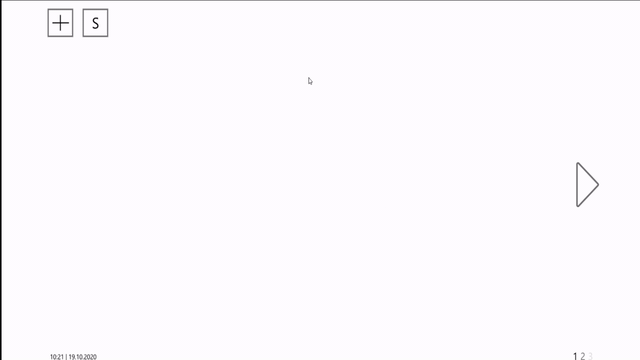

# Welcome to Robin's link and task container

This website was created as part of the HFU course interaction design with Prof. Rausch.

## TASKS
Within the scope of this course various tasks have to be accomplished:

### TASK 00
1. Prepare working environment -> check
2. Select a presentation topic -> check
3. SWOT analysis of yourself ->   [click](/SWOT.md)

### TASK 01
please view pdf in task01.rar

under consideration of the privacy policy this file is password protected. Please use the course password
[download rar](/task01.rar)

### TASK 02
1. concept for plant viewer (LowFid) ->   [click](/Scan0007.jpg)
2. Mid-/Highfid -> [click](https://xd.adobe.com/view/3e19e366-6382-450b-bfea-7027598a5683-6b4a)
Demo of big screen:

### TASK 03
1. Mid-/Highfid -> [click](https://xd.adobe.com/view/3e19e366-6382-450b-bfea-7027598a5683-6b4a)

### TASK 04
1. Mid-/Highfid -> [click](https://xd.adobe.com/view/3e19e366-6382-450b-bfea-7027598a5683-6b4a)

### TASK 05
1. VUI Storyline -> [click](/fith.md)

### TASK 06
WITH THE SETTING OF TASK 3,4

### TASK 07
A/B TEST
Presentation: [click](https://lieszard.github.io/ixd/A-B-Test.pdf)

### TASK 08
Idea of evil alarm -> [click](/8page.md)

### TASK 09
### TASK 10
### TASK 11
### TASK 12
### TASK 12

### TASK 12

### TASK 12

### TASK 12

### NOT DONE YET

